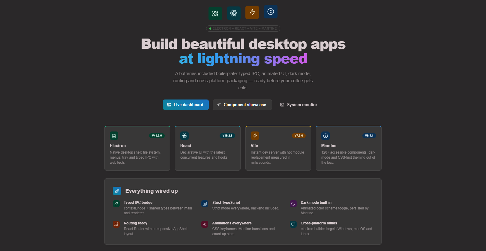

# Electron boilerplate

> Electron + React + Vite + Mantine

---

<div align="center">
  
  
</div>

<div align="center">
  
  
  
  
</div>

---

<!-- Badge Start -->
<div align="center">
 
 
 
 
 
 
 
</div>
<!-- Badge End -->

---



---

## What's inside

Demo pages that show what the stack can do out of the box:

- **Home** — animated hero with gradient headline, floating tech icons and stack cards (versions pulled from `package.json`);
- **Dashboard** — count-up stats, animated `RingProgress`, pure-CSS bar chart and activity timeline. Hit "Randomize data" and watch everything glide;
- **Showcase** — interactive playground for Mantine transitions, skeleton loading, loaders, hover effects and an animated modal;
- **System** — real Electron IPC: runtime versions, live memory/CPU polling every second and an IPC round-trip latency meter;
- **Gallery / Messages / Search / Profile / Settings** — everyday UI patterns with staggered entrance animations.

Under the hood: typed IPC bridge (`contextBridge` + shared types between main and renderer), shared CSS animation utilities (`src/styles/animations.css`), a `useCountUp` hook, and `prefers-reduced-motion` support everywhere.

---

## Help

- [Mantine](https://mantine.dev/)

## Getting Started

```bash
# Clone this repository
$ git clone https://github.com/saulotarsobc/sc-electron-boilerplate
# Go into the repository
$ cd sc-electron-boilerplate
# Install dependencies
$ npm install
# Run the app
$ npm run dev
```

---

## Available Scripts

```json
{
  "scripts": {
    "dev": "vite",
    "preview": "vite preview",
    "build": "tsc && vite build",
    "lint": "eslint . --ext .ts,.tsx",
    "postinstall": "electron-builder install-app-deps",
    "update-readme": "tsx scripts/update-readme.js",
    "generate-electron-builder": "tsx scripts/generate-electron-builder.ts",
    "dist:prepare": "npm run generate-electron-builder && npm run build",
    "dist": "npm run dist:prepare && electron-builder",
    "release": "pwsh -NoProfile -ExecutionPolicy Bypass -File ./scripts/release.ps1",
    "release:dry": "pwsh -NoProfile -ExecutionPolicy Bypass -File ./scripts/release.ps1 -DryRun",
    "release:notes": "pwsh -NoProfile -ExecutionPolicy Bypass -File ./scripts/changelog.ps1",
    "release:publish": "npm run dist:prepare && electron-builder --publish always",
    "format": "prettier --write \"src/**/*.{ts,tsx}\" \"backend/**/*.{ts,tsx}\" \"scripts/**/*.{ts,tsx}\"",
    "format:check": "prettier --check ."
  }
}
```

## Auto-update

The app checks this repository's GitHub Releases on launch, downloads a newer version in the
background, and shows a footer banner once the installer is ready.

Publishing is a single command, run from a development machine:

```powershell
npm run release          # publishes the version already in package.json
npm run release:dry      # simulates everything, creates no tag or release
npm run release:notes    # prints just the changelog that would be used

# To bump the version at the same time, call the script directly — npm does
# not forward single-dash flags:
pwsh ./scripts/release.ps1 -Bump patch
```

`release.ps1` runs, in order: environment checks, version resolution, `tsc --noEmit` + `eslint`,
pushes pending commits, creates and pushes the `vX.Y.Z` tag, builds the changelog from the
commits, creates the GitHub Release, and runs `npm run dist` publishing the assets. At the end it
downloads the published update manifest **without authentication** — exactly what a user's app
does — to prove the update chain is actually working.

Every step is idempotent: running it again with the same version does not duplicate the tag or the
release, and the assets are replaced.

electron-builder only builds for the platform it runs on. Publishing from Windows uploads the NSIS
installer and `latest.yml`; to add macOS and Linux artifacts, run this same script on those
machines — the release already exists by then, so the new assets are appended to it.

**Before the first run**, authenticate the GitHub CLI with `gh auth login`. The script also accepts
a `GH_TOKEN` environment variable or an `electron-builder.env` file (see
`electron-builder.env.example`); the token needs the `repo` scope.

## References

- [Electron Builder](https://www.electron.build/)
- [ElectronJS with NextJS](https://github.com/saulotarsobc/electronjs-with-nextjs)
- [Electron](https://www.electronjs.org/)
- [Vite](https://vite.dev/)
- [Como criar um app Electron usando Vite](https://dev.to/rafaelberaldo/como-criar-um-app-electron-usando-vite-52d6) - [@rfberaldo](https://github.com/rfberaldo)
